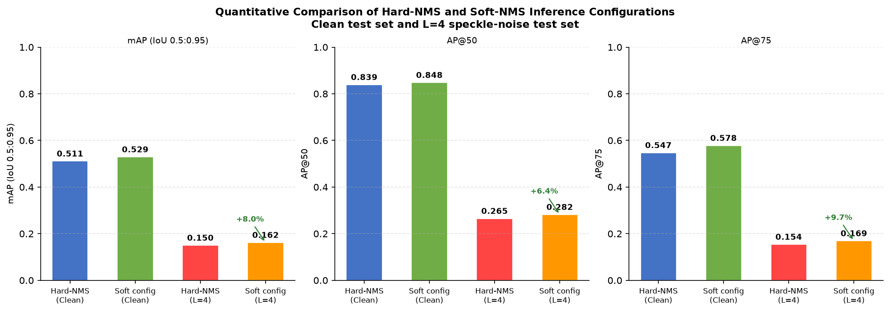

# Visual Media Final Report: Supplementary Code

This repository contains the supplementary code, configurations, results, and
figures for the University of Tokyo Visual Media final report:

> **Failure Analysis and Post-Processing Improvement of MSFA on SARDet-100K**

The work reproduces the released MSFA detector, evaluates two failure settings
(multiplicative SAR speckle and small objects), and compares the baseline
Hard-NMS configuration with a Soft-NMS inference configuration.

## Scope and provenance

The detector implementation, pretrained weights, and SARDet-100K dataset are
not redistributed here. Obtain them from the official project:

- [SARDet-100K official repository](https://github.com/zcablii/SARDet_100K)
- Li et al., *SARDet-100K: Towards Open-Source Benchmark and ToolKit for
  Large-Scale SAR Object Detection*, NeurIPS 2024 Spotlight.

This repository contains only the report-specific scripts and configurations.
See [THIRD_PARTY.md](THIRD_PARTY.md) for the ownership boundary.

## Repository contents

```text
configs/
  run_eval.py             Hard-NMS baseline evaluation configuration
  run_eval_softnms.py     Soft-NMS evaluation configuration
scripts/
  prepare_data.py         Speckle and COCO-subset generation
  generate_improved.py    Lee-filter and CLAHE preprocessing variants
  visualize_report.py     Detection and metric figures
results/
  summary.csv             Metrics transcribed from the evaluation logs
  README.md               Protocol and interpretation notes
figures/                  Final report figures generated by the scripts
```

The root-level `prepare_data.py`, `run_eval.py`, `run_eval_softnms.py`, and
`my_eval_config.py` files are compatibility entry points retained for links to
the repository's initial version. New use should follow the paths above.

Dataset images, annotations, pretrained checkpoints, raw server logs, and the
course report itself are intentionally excluded.

## Environment

The experiment used the upstream MSFA environment:

- Python 3.8
- PyTorch 2.0.1 and torchvision 0.15.2
- CUDA 11.8
- MMEngine 0.8.4
- MMCV 2.0.1
- MMDetection 3.1.0
- Kymatio 0.3.0 and torchhaarfeatures 0.0.2

Install the upstream repository first and follow its installation instructions.
The report-specific utility dependencies can then be installed with:

```bash
python -m pip install -r requirements.txt
```

## Data preparation

Set the dataset root once:

```bash
export SARDET_DATA_ROOT=/absolute/path/to/SARDet_100K
```

Generate the three Gamma-speckle test sets and the annotation subsets:

```bash
python scripts/prepare_data.py
```

The speckle model is

```text
I_noisy = I_clean * n,    n ~ Gamma(shape=L, scale=1/L)
```

A single `(H, W)` noise realization is broadcast across the stored image
channels, matching the grayscale nature of SAR imagery. The experiment used
`L = 1, 2, 4` and NumPy seed `42`. Images containing at least one annotation
with COCO area below `32^2` pixels are included in the small-object subset.

Generate the preprocessing variants evaluated during method selection:

```bash
python scripts/generate_improved.py
```

The Lee-filtered L=4 result is included in `results/summary.csv`; it was not the
selected final method because it did not improve the main mAP metric.

## Evaluation

Run the commands from the installed upstream SARDet-100K repository. Replace
the checkpoint path with the released MSFA wavelet checkpoint.

Clean test set with the baseline configuration:

```bash
export SARDET_IMG_PREFIX=JPEGImages/test/
python tools/test.py \
  /absolute/path/to/this-repository/configs/run_eval.py \
  /absolute/path/to/best_coco_bbox_mAP_epoch_12.pth
```

L=4 speckle test set with the Soft-NMS configuration:

```bash
export SARDET_IMG_PREFIX=JPEGImages/test_speckle_L4/
python tools/test.py \
  /absolute/path/to/this-repository/configs/run_eval_softnms.py \
  /absolute/path/to/best_coco_bbox_mAP_epoch_12.pth
```

Use `configs/run_eval.py` or `configs/run_eval_softnms.py` with either image
prefix to reproduce the four principal conditions. `SARDET_ANN_FILE` can be set
to `Annotations/subsets/test_small_obj.json` for the small-object subset.

## Results

| Inference configuration | Test images | mAP | AP50 | AP75 |
|---|---:|---:|---:|---:|
| Hard-NMS baseline | Clean | 0.511 | 0.839 | 0.547 |
| Soft-NMS configuration | Clean | 0.529 | 0.848 | 0.578 |
| Hard-NMS baseline | Speckle L=4 | 0.150 | 0.265 | 0.154 |
| Soft-NMS configuration | Speckle L=4 | 0.162 | 0.282 | 0.169 |



The L=4 Soft-NMS configuration improves mAP from `0.150` to `0.162` (an
absolute gain of `0.012`, or `8.0%` relative), but it does not recover the much
larger loss caused by speckle noise.

### Important ablation limitation

The Soft-NMS experiment changes the complete inference post-processing
configuration:

| Setting | Baseline | Soft configuration |
|---|---:|---:|
| NMS type | Hard-NMS | Soft-NMS |
| IoU threshold | 0.5 | 0.5 |
| Score threshold | 0.05 | 0.001 |
| Maximum detections/image | 100 | 300 |
| Soft-NMS minimum score | N/A | 0.001 |

Consequently, the reported gain should be interpreted as a comparison between
two inference configurations, not as a single-variable Soft-NMS ablation. This
limitation is stated explicitly so the released code and the report claims stay
aligned.

## Figures

```bash
export MSFA_CHECKPOINT=/absolute/path/to/best_coco_bbox_mAP_epoch_12.pth
python scripts/visualize_report.py
```

`MSFA_HARD_CONFIG`, `MSFA_SOFT_CONFIG`, and `VIS_OUTPUT_DIR` provide optional
path overrides. The committed figures are the outputs used in the report.

## License

The original supplementary material in this repository is released under the
MIT License. This license does not cover SARDet-100K, MSFA, MMDetection, the
dataset, or pretrained weights; those components retain their original terms.
